## Hands-on Lab — App Registration via Azure Portal

### Step 1 — Register the App

1. Go to [portal.azure.com](https://portal.azure.com)
2. Search **"Microsoft Entra ID"** in the top search bar
3. Left sidebar → **App registrations** → **+ New registration**
4. Fill in:
   - **Name:** `lab-graph-app`
   - **Supported account types:** *Accounts in this organizational directory only*
   - **Redirect URI:** leave blank for now
5. Click **Register**

You'll land on the app's overview page. Note down:
- **Application (client) ID**
- **Directory (tenant) ID**

---

### Step 2 — Create a Client Secret

1. Left sidebar → **Certificates & secrets**
2. Click **+ New client secret**
3. Description: `lab-secret`, Expires: 90 days
4. Click **Add**
5. **Copy the Value immediately** — it won't show again

---

### Step 3 — Add API Permission

1. Left sidebar → **API permissions**
2. Click **+ Add a permission**
3. Select **Microsoft Graph**
4. Select **Application permissions** (not delegated — since no user login)
5. Search `User.Read.All` → check it → **Add permissions**
6. Click **Grant admin consent for (your tenant)** → confirm

Status should turn green ✅

---

### Step 4 — Verify the Service Principal was created

1. Go back to **Microsoft Entra ID**
2. Left sidebar → **Enterprise applications**
3. Search `lab-graph-app` — you'll see it listed

This is the **Service Principal** — the app's identity instance in your tenant. App Registration = the definition. Enterprise App = the instance.

---

### Step 5 — Test it (Portal Token Explorer)

1. Go to [Graph Explorer](https://developer.microsoft.com/en-us/graph/graph-explorer)
2. Sign in with your account
3. Try `GET https://graph.microsoft.com/v1.0/users`

This confirms your tenant has Graph API access working.

---

### What each thing maps to

| Portal Section | What it really is |
|---|---|
| App Registration | App's identity definition |
| Client ID | App's unique identifier |
| Client Secret | App's password |
| API Permissions | What the app is allowed to do |
| Enterprise Applications | Service Principal (runtime instance) |
| Admin Consent | Admin approving the permissions |

---

### Step 6 — Cleanup

1. **Entra ID → App registrations** → find `lab-graph-app` → **Delete**

---

## Supported Account Types — Explained

| Option | Who can log in | Use when |
|---|---|---|
| **Single tenant — Default Directory** | Only users in **your** Entra ID tenant | Internal tools, company apps, service scripts |
| **Multiple Entra ID tenants** | Users from **any** org's Entra ID (work/school accounts) | SaaS apps you sell to other companies |
| **Any Entra ID + Personal Microsoft accounts** | Any org **+** outlook.com, hotmail.com, xbox accounts | Public apps like a productivity tool anyone can use |
| **Personal accounts only** | Only outlook.com, hotmail.com, live.com | Consumer-facing apps, no enterprise users |

---

## For your lab → pick **Single tenant — Default Directory**

Because:
- You're just learning
- Your script/app will only talk to **your** tenant
- No need to allow outside users
- Most real DevOps use cases (AKS workload identity, pipelines, daemons) are always single tenant

---

## Real world analogy

Think of it like AWS IAM:
- **Single tenant** = IAM role in your own account only
- **Multi tenant** = cross-account role that other AWS accounts can assume
- **Personal accounts** = not really an AWS equivalent, it's consumer identity

---

This is the **universal flow** — works for CosmosDB, Storage, Key Vault, Graph API, or any custom API. The only thing that changes between services is:

- **Step 5** — which permissions you add (CosmosDB has its own, Graph has its own)
- **Step 6** — whether you need an RBAC role on the Azure resource itself (CosmosDB needs it, Graph API doesn't)

